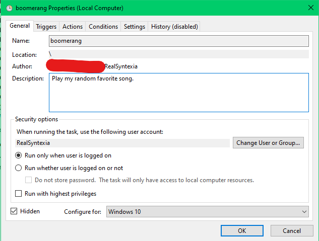
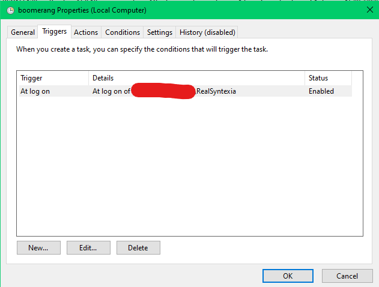
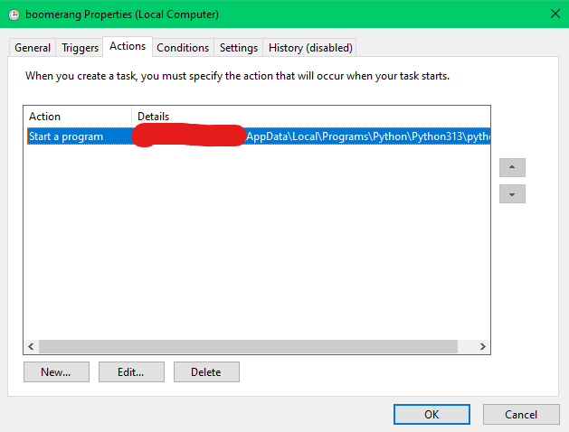

# Initiate Syntexia:

- Windows:

  This is to be used in conjunction with Task Scheduler.

[FFMPEG Documentation](https://ffmpeg.org/ffmpeg.html#AVOptions)

Arguments used:
**-ss _position_**
Sets the start input of the audio input

```
    ffmpeg -ss 80 -i song.mp3 song.wav
```

Returns only the "three-part call interlude" of the song [AiScream](https://www.youtube.com/watch?v=dx0YT7eGZRY&t=90s)

```
    ffmpeg -ss 91 -i aiscream.mp3 -t 22.5 aiscream.wav
```

### Window's Task Scheduler

**General:**



**Triggers:**


**Actions:**

Add the script as the argument.


